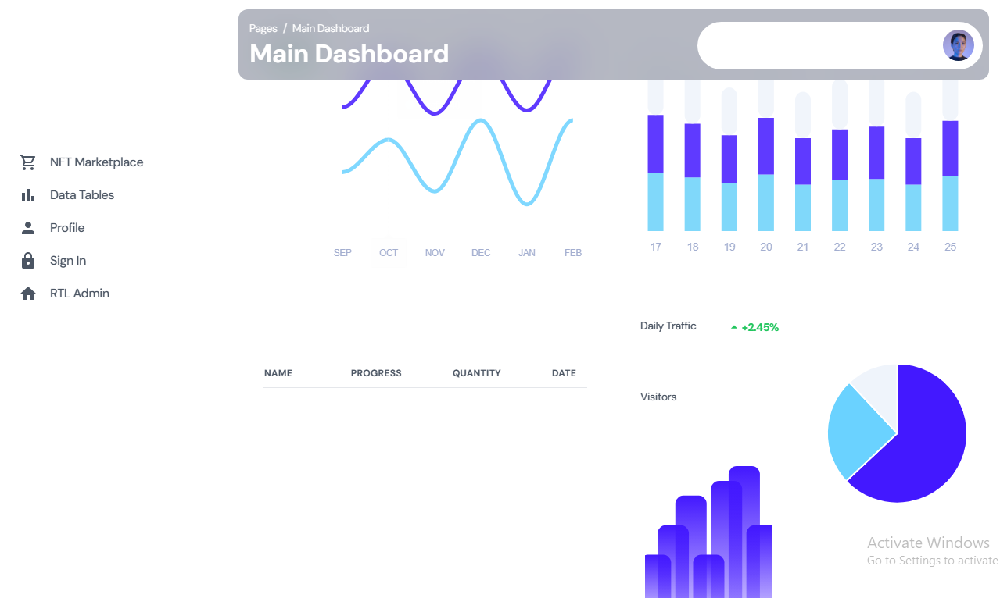

# React Dashboard
### :hammer_and_wrench: Languages and Tools :

<div>
  &nbsp;
  &nbsp;
  
  &nbsp;
  &nbsp;
  &nbsp;
  &nbsp;
</div>

---

## Quick Start

- Install NodeJS from [NodeJs Official Page](https://nodejs.org/en).

- Clone the repository with the following command:

```bash
git clone https://github.com/fikireab-m/dashboard_react_tailwind.git
```

Run in terminal this command:

```bash
npm install
```

Then run this command to start your local server

```bash
npm run dev
```

To build your application run this command

```bash
npm build
```
